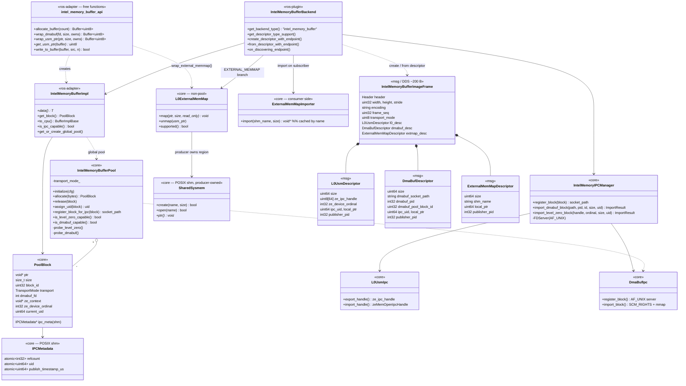
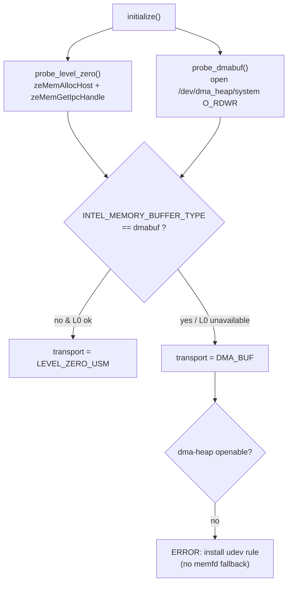
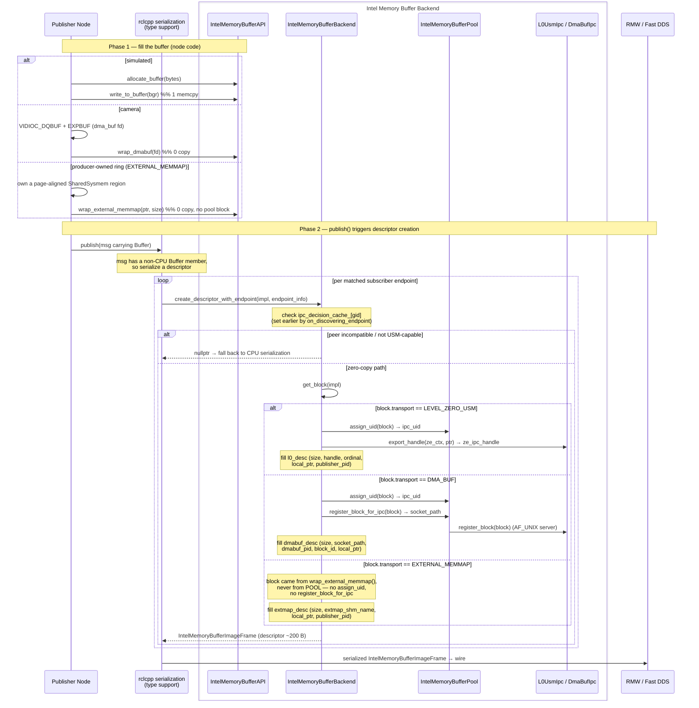

# Intel Memory Buffer Backend (Intel Level Zero USM + DMA-BUF + External Memory Mapping)

- **Status:** Draft under review (implemented)
- **Scope:** `intel_memory_core` (ROS-free) + `intel_buffer` + `intel_buffer_backend` + `intel_buffer_backend_msgs`
- **Platform:** Intel Core Ultra, unified DRAM shared by CPU / iGPU / IPU / NPU
- **ROS 2:** Jazzy, `rmw_fastrtps_cpp`

---

## 1. Context

The ROS2 DDS([Data Distribution Service](https://design.ros2.org/articles/ros_on_dds.html)) zero-copy
proposal establishes the goal: move any sensor data across the ROS2 nodes **without any copy**,
on a Intel Core Ultra architecture where CPU, iGPU, IPU and NPU all share the same physical DRAM.

Stock ROS 2 sends the full payload on the DDS wire (serialize → transport →
deserialize), for example media workloads with image data type can have 960×540 BGR frame is ~1.5 MB
copied several times per frame, per subscriber. That defeats the point of a unified-memory architecture.

The [rosidl](https://github.com/ros2/rosidl)(ROS repo for Interface Definition Langauage tool for definition and
code generation) buffer-backend mechanism lets a message carry an *out-of-band* buffer
whose data plane is separate from the DDS control plane. This ADR covers the **Intel-specific backend**
that implements that data plane using the Intel memory backends: the backend publishes
a small (~200 B) descriptor on DDS, and subscribers import the *same physical pages* the
publisher wrote into.

## 2. Problem Definition

To share a sensor data (for example frame buffer) across **processes** *and* across **devices** on Intel Core architecure,
the backend must answer three questions per sensor data:

1. **Allocation** — where do the pixels physically live so every subsystem can reach them?
2. **Cross-process handoff** — how does another *process* obtain access to those same pages? (Pointers and fds are process-local.)
3. **Cross-device access** — can the iGPU/IPU/NPU read those pages for inference without a copy?

There is no single Linux/Intel primitive that cleanly satisfies all three on
this hardware today. That is the core tension this ADR resolves.

---

## 3. Decision

**Support three zero-copy transports behind one backend interface: two
pool-managed transports selected at pool-init time, plus a third,
non-pool-managed transport chosen explicitly by producer code:**

- **Level Zero Host USM** (`zeMemAllocHost`) — the *preferred* path for unified CPU/iGPU/NPU access.
- **DMA-BUF** Allocate DMA buff using [DMA heap](https://docs.kernel.org/next/userspace-api/dma-buf-heaps.html).
  DMA heap driver is the exporter and to share DMA-BUF across the processes(publisher ROS node to subscriber ROS node),
  kernel dma-heap fd, shared via UNIX domain scoket(`AF_UNIX`) + `SCM_RIGHTS` — is the *robust cross-process* path.
  It is simply the most common, portable, cooperative, unprivileged, runtime IPC mechanism for passing fds between unrelated
  processes on the same host. UNIX domain sockets explicitly support passing file descriptors using ancillary data
- **External Memory Mapping** (`L0ExternalMemMap`, `TransportMode::EXTERNAL_MEMMAP`) — maps an
  **application-owned**, page-aligned system-memory buffer as Level Zero USM host memory via the
  `ZE_extension_external_memmap_sysmem` extension, with no pool allocation and no IPC handle/socket
  rendezvous. Used when a producer already owns its buffer (e.g. a pre-allocated ring outside the
  pool) and only needs the *same physical pages* visible to the iGPU/NPU; a POSIX shared-memory name
  (`SharedSysmem`) is the only thing published cross-process.

Selection of the first two is via `INTEL_MEMORY_BUFFER_TYPE` (`l0usm` | `dmabuf`), which the launch
`transport_mode` parameter (`L0_USM` | `DMA_BUF`) maps onto. If we use Camera sensor source is
always DMA-BUF (the V4L2 buffer is already a dma_buf fd). **External Memory Mapping is not part of
this env-var selection** — `IntelMemoryBufferPool` never probes for or produces `EXTERNAL_MEMMAP`
blocks; a producer opts in explicitly by calling `wrap_external_memmap()` /
`ExternalMemMapRing` (`intel_buffer_api.hpp`) on memory it already owns.

### 3.1 When to use which Intel memory buffer backend

- **L0 USM** is used when a user-space application/ROS node needs to allocate memory for the sensor data then use
  this buffer backend type. It works today for both **intra-process**, **inter-process** and on newer runtimes (26.x+)
  that add shared-memory IPC.
- **DMA-BUF** is used when sensor driver is allocating the memory using DMA then use this buffer backedn.
  It is also supports cross-process, cross-device* path: a dma-heap fd is CPU-mmap'able, importable by
  `xe` / `intel_ipu7` / `intel_vpu`, and the natural representation for camera sensors.
- **External Memory Mapping** is used when the producer already owns page-aligned system memory outside
  the pool (not allocated via `zeMemAllocHost` or a DMA heap) and wants it mapped zero-copy into Level
  Zero without going through the pool's allocate/refcount machinery — e.g. a fixed producer-owned ring.
  Cross-process sharing rides on a POSIX SHM name (`SharedSysmem`) rather than an `AF_UNIX`/`SCM_RIGHTS`
  handoff or an L0 IPC handle, so the descriptor on the wire is even smaller. Requires the running Level
  Zero driver to advertise `ZE_extension_external_memmap_sysmem` (`L0ExternalMemMap::supported()`);
  callers should probe and fall back to a copy-based path if unsupported.

### 3.2 Layering: a reusable ROS-free core

The memory machinery — **allocation, pool management, cross-process IPC, and
cross-process synchronization** — has no intrinsic dependency on ROS 2. Only the
*adapter* that exposes it as a `rosidl::Buffer` does. We therefore split the
implementation into two layers so the same engine serves ROS **and** non-ROS
workloads:

| Layer | Package | Build | ROS deps | Contains |
|-------|---------|-------|----------|----------|
| **Generic core** | `intel_memory_core` | plain CMake (standalone) | **none** | `IntelMemoryBufferPool`, `PoolBlock`, `IPCMetadata`, `L0UsmIpc`, `DmaBufIpc`, `IntelMemoryIPCManager`, `L0ExternalMemMap`/`SharedSysmem`/`ExternalMemMapImporter` (non-pool), `logging.hpp` shim |
| **ROS adapter** | `intel_buffer` | ament (header-only INTERFACE) | `rosidl_buffer` + core | `IntelMemoryBufferImpl` (a `rosidl::BufferImplBase<T>`), `intel_buffer_api` helpers, `get_or_create_global_pool()` |
| **ROS plugin** | `intel_buffer_backend` | ament | pluginlib + adapter + core | `IntelMemoryBufferBackend` (`rosidl::BufferBackend`) |

**Decision:** `intel_memory_core` is a standalone CMake package with a
`find_package(intel_memory_core)` config and **zero** ROS/rosidl/rcutils
dependencies. Logging goes through a tiny `logging.hpp` shim (stderr) instead of
`rcutils`. The ROS adapter is a thin header-only layer that wraps a core
`PoolBlock` inside `rosidl::BufferImplBase<T>` and returns `rosidl::Buffer`.

## 4. Low-Level Design

### 4.1 Component / class diagram

Stereotypes mark the layer: `<<core>>` = ROS-free `intel_memory_core`,
`<<ros-adapter>>` = `intel_buffer`, `<<ros-plugin>>` =
`intel_buffer_backend`, `<<msg>>` = `intel_buffer_backend_msgs`.
Everything below the `intel_buffer_api` / `IntelMemoryBufferImpl` line is
reusable by non-ROS code unchanged.



### 4.2 Buffer lifecycle & reference counting

- Each `PoolBlock` owns an `IPCMetadata` struct in a POSIX shared-memory segment
  (`/intel_memory_buffer_<pid>_<block_id>`) containing an atomic `refcount`.
  This lives in `intel_memory_core`, so the refcount works between any two
  processes — ROS or not.
- On import, the backend increments `refcount`; on the imported buffer's
  destruction it decrements it (`intel_memory_buffer_backend_plugin.cpp`).
- `allocate()` will only recycle a block whose `refcount == 0`
  (`is_block_ready`), so a buffer still being read by a subscriber is never
  overwritten. The pool grows on demand up to `max_blocks` and force-recycles
  the oldest free block under pressure.

### 4.3 Transport selection (pool init)



Both probes run so capability is known for either choice; the active transport
is what the log's `Using ... transport` line reports.

`EXTERNAL_MEMMAP` is deliberately absent from this flowchart: it is not a pool
transport, is never probed by `initialize()`, and `IntelMemoryBufferPool` never
produces blocks of this mode. A producer that wants it calls
`L0ExternalMemMap::supported()` directly and, if true, uses
`wrap_external_memmap()` on memory it already owns — independent of whichever
transport the pool selected above.

---

## 5. Sequence Diagrams

### 5.1 Publish ROS node (producer side)



**Who triggers what:** DDS/RMW never calls the backend — it only carries the
already-serialized `IntelMemoryBufferImageFrame`. The trigger is `publish()` → the **rclcpp
serialization layer**, which (seeing a non-CPU `Buffer` member) calls
`create_descriptor_with_endpoint()` **once per matched subscriber**. That call is
the sole entry point: it reads the `PoolBlock` off the impl, calls `assign_uid()`
on the pool, then — branching on `block->transport` — either
`L0UsmIpc::export_handle()` or the pool's `register_block_for_ipc()` (which starts
the `AF_UNIX` server via `DmaBufIpc`). A `nullptr` return means "this peer can't
do zero-copy" and the layer falls back to normal CPU serialization for it.

### 5.2 Subscriber node Import + GPU inference (consumer side)

```mermaid
sequenceDiagram
  participant SUB as Subscriber Node / OpenVINO GPU
  participant DDS as RMW / Fast DDS
  participant DES as rclcpp deserialization<br/>(type support)
  box Intel Memory Buffer Backend
  participant BK as IntelMemoryBufferBackend
  participant IPC as IntelMemoryIPCManager
  end
  participant SHM as Shared DRAM (L0 USM / dma_buf / extmemmap pages)

  Note over DDS,DES: descriptor arrives on the wire
  DDS->>DES: serialized IntelMemoryBufferImageFrame (~200 B)
  DES->>BK: from_descriptor_with_endpoint(descriptor, endpoint_info)

  alt local_ptr != 0 && publisher_pid == getpid()  (intra-process)
    BK->>SHM: wrap local_ptr directly (no IPC, no refcount)
  else LEVEL_ZERO_USM (cross-process)
    BK->>IPC: import_level_zero_block(ze_ipc_handle, ordinal, size, uid)
    IPC->>IPC: zeMemOpenIpcHandle → CPU/GPU-mapped ptr
    IPC->>SHM: pointer to same physical pages
    IPC-->>BK: ImportResult{ptr, ipc_meta}
    BK->>SHM: ipc_meta->refcount++ (shm)
  else DMA_BUF (cross-process)
    BK->>IPC: import_dmabuf_block(socket_path, pid, block_id, size, uid)
    IPC->>IPC: connect() → recv fd (SCM_RIGHTS) → mmap
    IPC->>SHM: pointer to same physical pages
    IPC-->>BK: ImportResult{ptr, ipc_meta}
    BK->>SHM: ipc_meta->refcount++ (shm)
  else EXTERNAL_MEMMAP (cross-process)
    BK->>BK: ExternalMemMapImporter::import(shm_name, size)
    BK->>SHM: SharedSysmem::open(shm_name) → mmap producer's region
    BK->>SHM: L0ExternalMemMap::map(ptr, size) → USM host ptr (== ptr)
    Note over BK: cached by shm_name for process lifetime;<br/>no IPCMetadata refcount segment (block never came from POOL)
  end

  BK-->>DES: IntelMemoryBufferImpl (custom deleter → refcount-- on destroy, if pool-managed)
  DES-->>SUB: msg with Buffer bound to shared pages
  SUB->>SHM: get_usm_ptr(buffer) — read same pages (zero copy)
  SUB->>SUB: wrap as ov::Tensor (NV12/BGR) → GPU preprocess + SSD infer
  Note over SUB,SHM: on buffer destruction the deleter does refcount--,<br/>freeing the block for pool reuse (n/a for EXTERNAL_MEMMAP — no pool block)
```

**Who triggers what:** as on the publish side, DDS/RMW only delivers the
serialized bytes — it does not call the backend. The **rclcpp deserialization
layer** calls `from_descriptor_with_endpoint()`, which branches on
`frame->transport_mode`. If the descriptor was produced in this same process
(`local_ptr != 0 && publisher_pid == getpid()`) it wraps `local_ptr` directly and
skips IPC entirely; for `LEVEL_ZERO_USM`/`DMA_BUF` it imports through
`IntelMemoryIPCManager` (`import_level_zero_block` / `import_dmabuf_block`), bumps
the shared-memory `refcount`, and returns an `IntelMemoryBufferImpl` whose custom
deleter decrements that `refcount` on destruction (see §4.2) so the pool can
recycle the block. For `EXTERNAL_MEMMAP` there is no pool block or refcount to
manage: `ExternalMemMapImporter::import()` opens the producer's `SharedSysmem`
region by name and maps it via `L0ExternalMemMap::map()`, caching the result by
`shm_name` for the process lifetime (mapping the same physical pages twice into
one Level Zero context is prohibited by the extension).

## How to test the intel Buffer backend

Sample ROS2 workload using intel buffer backend is found at [Sample](../intel_buffer_backend/test_intel_buffer_backend/README.md)


## Package layout

| Package | Build | Responsibility |
|---------|-------|----------------|
| `intel_memory_core` | plain CMake (ROS-free) | Memory pool, both pool-managed IPC mechanisms (`l0_usm_ipc`, `dmabuf_ipc`), IPC manager, `IPCMetadata` refcount, plus the non-pool `l0_external_memmap` (`L0ExternalMemMap`, `SharedSysmem`, `ExternalMemMapImporter`) |
| `intel_buffer` | ament (header-only) | `rosidl::Buffer` adapter over the core (`IntelMemoryBufferImpl`, `intel_memory_buffer_api`, `wrap_external_memmap()`/`ExternalMemMapRing`) |
| `intel_buffer_backend` | ament | `rosidl::BufferBackend` plugin: descriptor create/import (branches on `LEVEL_ZERO_USM` / `DMA_BUF` / `EXTERNAL_MEMMAP`) |
| `intel_buffer_backend_msgs` | ament | `IntelMemoryBufferImageFrame`, `L0UsmDescriptor`, `DmaBufDescriptor`, `ExternalMemMapDescriptor` |
| `test_intel_buffer_backend` | ament | Sample pipeline nodes (camera publisher, OpenVINO inference, visualizer) + launch |

---
