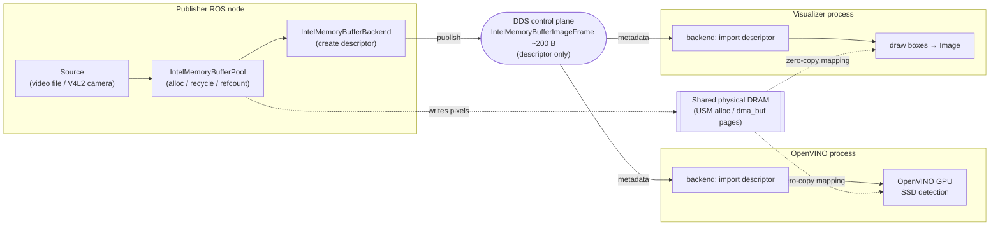

# Sample visual analytcs ROS2 Workload (the pipeline uses intel buffer backend)

Intel Buffer backend implementation is tested with a four-nodes ROS2 pipeline, each node a separate process:

This ROS2 pipeline has 4 nodes.
1. Camera node (simulator of camera using static video file and actual USB camera) 
2. Openvino inference node - Runs SSD (single shot detection) model on GPU/NPU
3. Detection_visualizer  — Imports buffer, draws bounding boxes, publishes annotated sensensor_msgs/Image
4. Rviz2 node - Displays the annotated image

| # | Node | Role | Buffer interaction |
|---|------|------|--------------------|
| 1 | `video_dmabuf_sim` (`video_publisher_node`) | Source. `simulated` = video file → `allocate_buffer` + one `write_to_buffer` memcpy; `camera` = V4L2 → `wrap_dmabuf` (zero copy) | **Produces** `IntelMemoryBufferImageFrame` |
| 2 | `openvino_pipeline` (`openvino_pipeline_node`) | Imports frame, runs SSD object detection on the iGPU via OpenVINO, publishes `vision_msgs/Detection2DArray` | **Imports** frame (zero copy → `ov::Tensor`) |
| 3 | `detection_visualizer` (`detection_visualizer_node`) | Imports frame + detections, draws boxes, publishes annotated `sensor_msgs/Image` | **Imports** frame |
| 4 | `rviz2` | Displays annotated image | standard ROS |

Frame data lives in one shared buffer for its whole life; nodes 2 and 3 read the
publisher's pages directly. Only the descriptor and the (small) detection /
annotated messages traverse DDS.

## High-Level Design of ROS2 pipeline where it uses the Intel memory buffer backend



## Test the workload

Build the ROS2 workload

```bash
cd ..
git clone https://github.com/ros2/rosidl
colcon build --packages-select \
    intel_memory_core \
    intel_buffer_backend_msgs \
    intel_buffer \
    intel_buffer_backend \
    test_intel_buffer_backend \
    --cmake-args -DRMW_IMPLEMENTATION=rmw_fastrtps_cpp
```

Complete the [pre-requisite](../README.md#pre-requisite) before running the workload

To run the pipeline with USB camera
Add the current $USER to `render` and `video` group 

```bash
sudo sudo usermod -aG render,video $USER
```

Launch the ROS2 workload

```bash
ros2 launch test_intel_memory_buffer_backend test_intel_buffer_backend_openvino.launch.py \
  source_mode:=<simulated/camera> \
  video_path:=<mp4-video-path> \
  transport_mode:=<L0_USM/DAM_BUF> \
  device:=<GPU/NPU> \
  model:=<model xml file path>
```

- If the `source_mode` is `simulated` then `video_path` is required.
- If `source_mode` is `camera` then don't need to pass `video_path`, but `camera_device`
camera device path(which supports NV12) has to be passed, example /dev/video0.
- Tested this ROS2 pipeline with UVC webcam.
- OpenVINO models those are tested - [ssdlite_mobilenet_v2](https://docs.openvino.ai/2023.3/omz_models_model_ssdlite_mobilenet_v2.html)
and [face-detection-retail-0004](https://docs.openvino.ai/2023.3/omz_models_model_face_detection_retail_0004.html)
