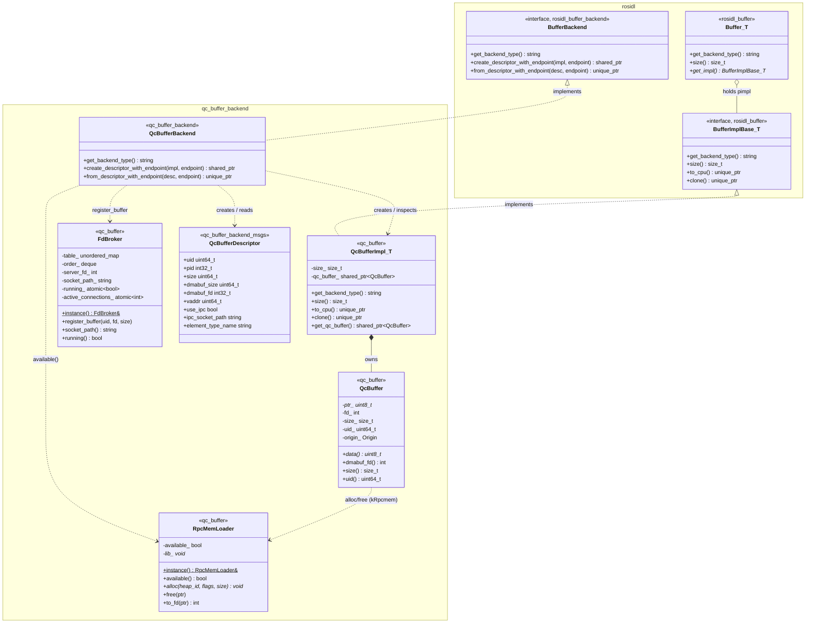
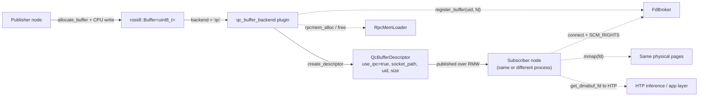
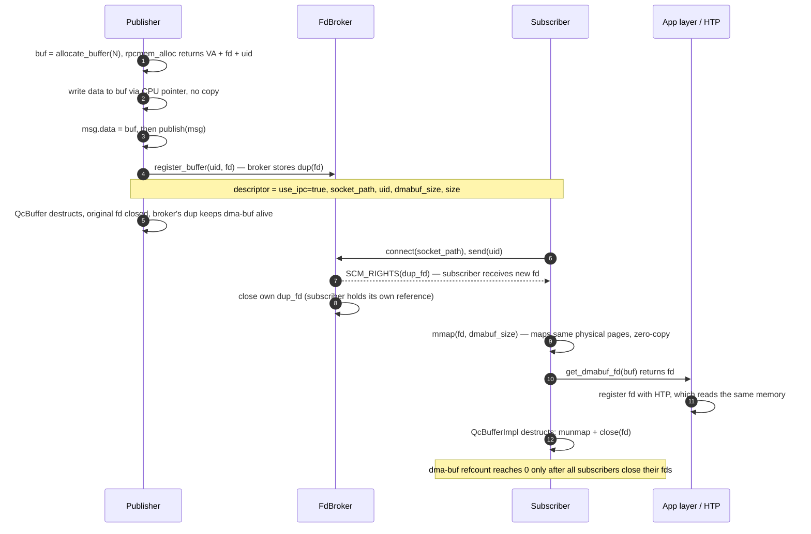
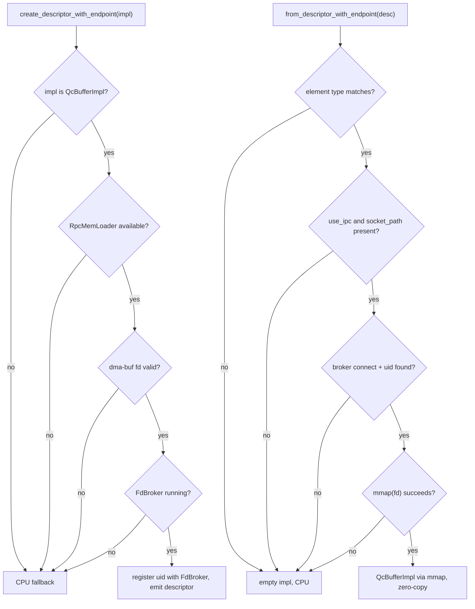
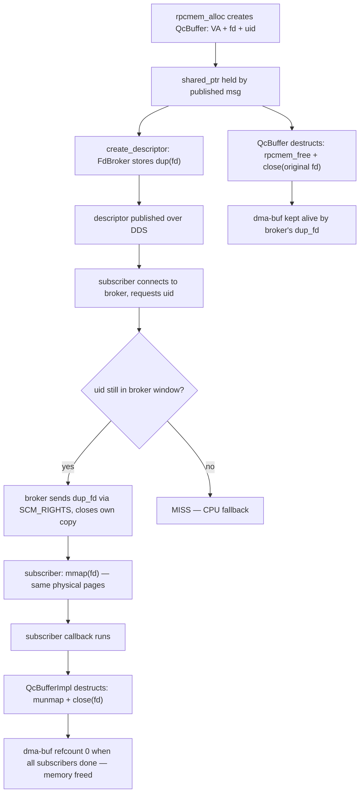

# Design

## Introduction

`qc_buffer_backend` is a `rosidl::Buffer<T>` storage backend that allocates the message payload in Qualcomm ION / dma-buf memory and delivers it to a subscriber **without serialization or host copies** when the runtime conditions allow it. When they don't, the system falls back to the default CPU path automatically.

The optimized path is taken when the publisher and subscriber are on the **same device**. The ION buffer is CPU-accessible and, through its dma-buf fd, can be shared with the HTP (Qualcomm NPU) accelerator so it reads the exact same physical pages the CPU wrote — this is what makes HTP-CPU zero-copy possible. Both same-process and cross-process subscribers on the same device are supported.

## Class diagram

Classes are grouped by origin. **ROS2 framework classes** (from `rosidl` / `rosidl_buffer`) are shown in the `rosidl` package. **`qc_buffer_backend` classes** (implemented in this repository) are shown in the `qc_buffer_backend` package.

## Class descriptions of `qc_buffer_backend`

These classes are implemented in folder `qc_buffer_backend`. They are split across three ROS2 packages: `qc_buffer` (core library), `qc_buffer_backend` (plugin), and `qc_buffer_backend_msgs` (message definition).

#### `QcBufferBackend` — `qc_buffer_backend` package

The pluginlib plugin entry point. On the publish path, `create_descriptor_with_endpoint()` extracts the dma-buf fd from the `QcBufferImpl`, registers it with `FdBroker`, and fills a `QcBufferDescriptor`. On the subscribe path, `from_descriptor_with_endpoint()` connects to the publisher's broker socket, receives a fd via `SCM_RIGHTS`, calls `mmap()`, and constructs a new `QcBufferImpl`. Any failure returns an empty impl, triggering a DDS CPU fallback.

#### `QcBufferImpl<T>` — `qc_buffer` package

The Qualcomm implementation of `BufferImplBase<T>`, holding a `shared_ptr<QcBuffer>`. Three construction paths:
- **Default**: empty impl (size 0, no allocation).
- **By size**: publisher path — calls `rpcmem_alloc` via `QcBuffer(byte_size)`.
- **By fd**: subscriber path — calls `mmap(fd)` and wraps the result in `QcBuffer(ptr, size, fd)`.

Destruction delegates to `QcBuffer::reset()`, which calls either `rpcmem_free` or `munmap + close(fd)` depending on the `Origin` tag.

#### `QcBuffer` — `qc_buffer` package

RAII owner of a single ION / dma-buf allocation. Non-copyable. Two origin variants:
- **kRpcmem**: allocated by the publisher via `rpcmem_alloc`; `reset()` calls `rpcmem_free`.
- **kMmap**: mapped by the subscriber via `mmap(fd)`; `reset()` calls `munmap + close(fd)`.

`uid()` is a process-monotonic identifier used by `FdBroker` for fd lookup. `dmabuf_fd()` is the kernel fd passed to the HTP accelerator for zero-copy access.

#### `FdBroker` — `qc_buffer` package

A process-level singleton Unix socket server in the publisher process. `register_buffer()` calls `dup(fd)` on each newly published buffer's dma-buf fd, keeping the kernel dma-buf object alive after `QcBuffer` destructs. Any subscriber (same or different process on the same device) connects, sends the uid, and receives a fd copy via `sendmsg + SCM_RIGHTS`; the broker then closes its own dup. A rolling FIFO window (64 slots) bounds memory retention. The destructor spins on `active_connections_` to ensure all detached connection threads finish before tearing down internal state.

#### `RpcMemLoader` — `qc_buffer` package

A process-level singleton that `dlopen`s `libcdsprpc.so` and resolves `rpcmem_alloc`, `rpcmem_free`, and `rpcmem_to_fd`. When `available()` returns false (library absent, e.g. on a developer host), the entire backend falls back to the CPU path transparently.

#### `QcBufferDescriptor` — `qc_buffer_backend_msgs` package

The lightweight descriptor transmitted from publisher to subscriber over DDS. Key fields: `uid` for broker lookup, `ipc_socket_path` for the broker Unix socket, `dmabuf_size` for the `mmap()` call, and `use_ipc` to signal whether the FdBroker path is active. The `pid`, `vaddr`, and `dmabuf_fd` fields carry debug information about the publisher-side allocation.

## High-level architecture

## Publish / subscribe flow

The subscriber performs **no memcpy**: its `mmap()`-ed address and the publisher's original `vaddr` point at the same physical pages (zero-copy).

## Fallback decision

The backend never breaks functionality; the worst case is a CPU copy. It falls back (returns `nullptr` / an empty impl, letting the serialization layer use the CPU path) when any of the following holds:

A **type or contract violation** (e.g. a non-`uint8_t` element type name, or an explicit qc allocation that fails) is treated as an error — allocation throws `QcError`, while `from_descriptor` logs and drops. An **environmental limitation** (no rpcmem, cross-device, broker miss) is a normal expected downgrade and only logs at WARN (once where appropriate).

## Buffer lifetime

The `FdBroker` retention window (64 slots, FIFO eviction) bounds how long a buffer's fd is kept available for subscribers. At 30 Hz a window of 64 covers over 2 seconds. A subscriber that arrives after eviction sees a miss and falls back to CPU.
